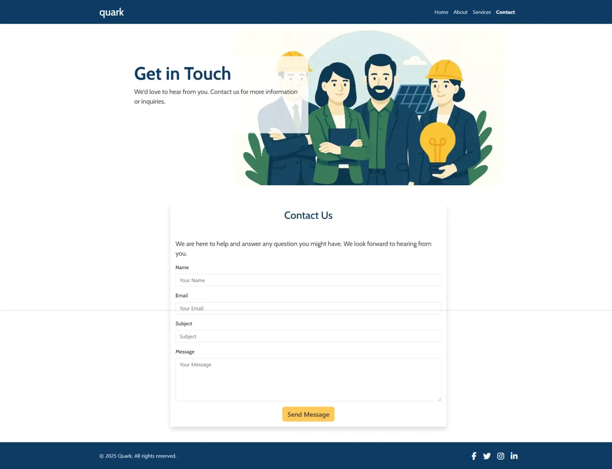

# Quark - Sustainable Construction Consulting

Quark is a Colombian consulting company dedicated to promoting sustainable construction. This website serves as a platform to showcase Quark's services, mission, and expertise while providing users with an easy way to contact the company.

## Purpose
The purpose of this application is to:
- Highlight Quark's commitment to sustainable construction.
- Provide detailed information about services, team, and mission.
- Allow users to contact Quark for inquiries or consultations.

## User Value
- **Informative**: Users can learn about Quark's services, mission, and team.
- **Engaging**: A visually appealing design with responsive features ensures a seamless experience across devices.
- **Accessible**: Easy navigation and contact forms make it simple for users to reach out.

## Features
1. **Home Page**: Overview of Quark's mission, services, and testimonials.
2. **About Page**: Detailed information about the company and its team.
3. **Contact Page**: A form for users to submit inquiries.
4. **Thank You Page**: Confirmation message after form submission.

## Screenshots
### Home Page

*Showcases Quark's mission and services, providing users with an overview of the company's offerings.*

### About Page

*Introduces the team and highlights Quark's values and expertise.*

### Contact Page

*Allows users to submit inquiries directly to Quark.*

### Thank You Page

*Confirms successful form submission and guides users back to the home page.*

## Deployment Procedure
1. Clone the repository:
   ```bash
   git clone https://github.com/yourusername/quark-project.git