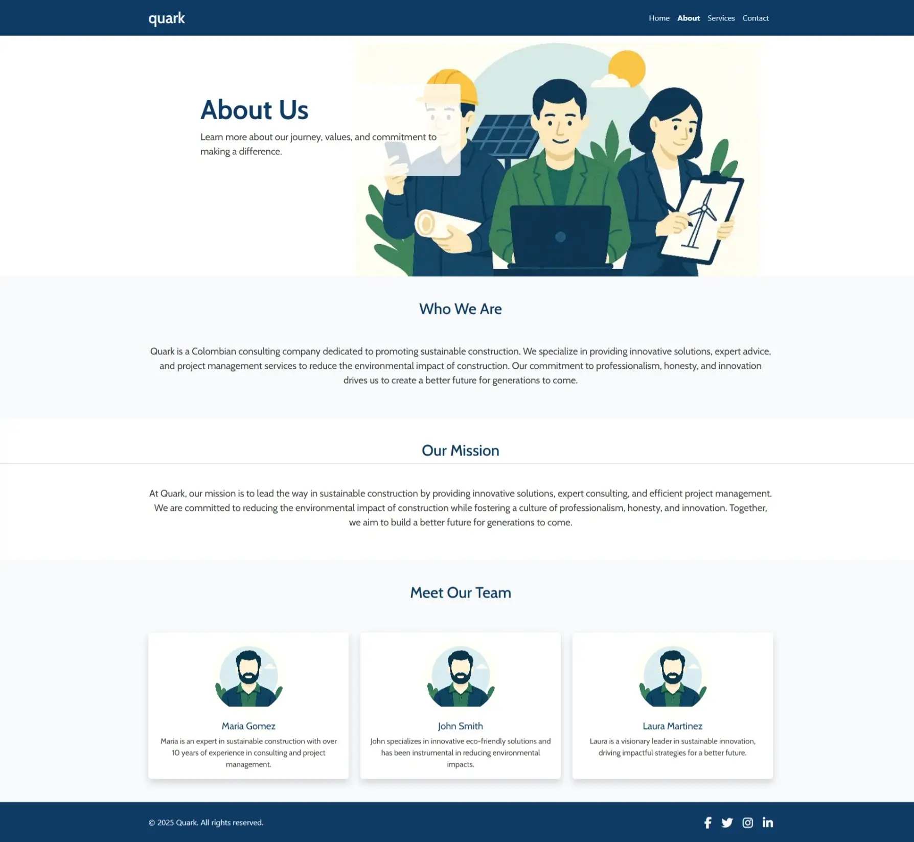

# Quark - Sustainable Construction Consulting

Quark is a Colombian consulting company dedicated to promoting sustainable construction. This website serves as a platform to showcase Quark's services, mission, and expertise while providing users with an easy way to contact the company.

## Purpose
The purpose of this application is to:
- Highlight Quark's commitment to sustainable construction.
- Provide detailed information about services, team, and mission.
- Allow users to contact Quark for inquiries or consultations.

## User Value
- **Informative**: Users can learn about Quark's services, mission, and team.
- **Engaging**: A visually appealing design with responsive features ensures a seamless experience across devices.
- **Accessible**: Easy navigation and contact forms make it simple for users to reach out.

## Features
1. **Home Page**: Overview of Quark's mission, services, and testimonials.
2. **About Page**: Detailed information about the company and its team.
3. **Contact Page**: A form for users to submit inquiries.
4. **Thank You Page**: Confirmation message after form submission.

## Screenshots
### Home Page

*Showcases Quark's mission and services, providing users with an overview of the company's offerings.*

### About Page

*Introduces the team and highlights Quark's values and expertise.*

### Contact Page

*Allows users to submit inquiries directly to Quark.*

### Thank You Page

*Confirms successful form submission and guides users back to the home page.*

### Performance

*Performance test*

## Deployment Procedure
1. Clone the repository:
   ```bash
   git clone https://github.com/yourusername/quark-project.git
   ```
2. Navigate to the project directory:
   ```bash
   cd quark-project
   ```
3. Install the dependencies:
   ```bash
   npm install
   ```
4. Start the development server:
   ```bash
   npm start
   ```
5. Open your browser and go to `http://localhost:3000` to view the website.

## Fixes and Patches (EBI Recommendations)

### Accessibility & Usability
- **Descriptive Alt Text for Images:**  
  Carefully reviewed all image `alt` attributes to ensure each one is unique and contextually meaningful. For example, instead of repeating "Portrait of...", each team member’s image now uses their full name and role, improving accessibility for screen readers and users with visual impairments.

- **Corrected Broken Image Paths:**  
  Identified and fixed a typo in the image filename (`ventilation..webp` → `ventilation.webp`). This ensures that all images load correctly across browsers and devices, preventing broken visuals and maintaining a professional appearance.

### Interactivity & Design
- **Enhanced Navbar Hover Effects:**  
  Added CSS hover effects to navigation bar links, providing immediate visual feedback when users interact with the menu. This small but important change improves the overall user experience and makes navigation more intuitive.

### Responsiveness
- **Improved Mobile Layouts with Media Queries:**  
  Refined CSS media queries to ensure that cards, columns, and grid/flexbox containers stack vertically on smaller screens. This guarantees that content remains readable and visually appealing on all devices, especially smartphones and tablets.

### Documentation & Quality Assurance
- **Table of Contents for README:**  
  Introduced a clear and organized table of contents at the top of the README file, making it easier for users and contributors to navigate the documentation and find relevant information quickly.

- **Validation and Performance Evidence:**  
  Ran HTML and CSS files through official validators and included screenshots of the validation results in the README. Also added performance audit screenshots (e.g., from Lighthouse) to demonstrate the site’s optimization and adherence to web standards.

## JavaScript Features

- **Real-Time Contact Form Validation:**  
  Implemented a custom JavaScript validation script for the contact form. This feature provides instant feedback as users fill out the form fields, displaying clear error messages for invalid or incomplete entries before submission. This improves data quality, reduces user frustration, and enhances accessibility by ensuring all required information is provided in the correct format.

- **Smooth Scrolling and Responsive Navbar:**  
  Added JavaScript to enable smooth scrolling to internal page sections when navigation links are clicked. On mobile devices, the navigation menu automatically collapses after a link is selected, providing a seamless and intuitive user experience across all devices.  